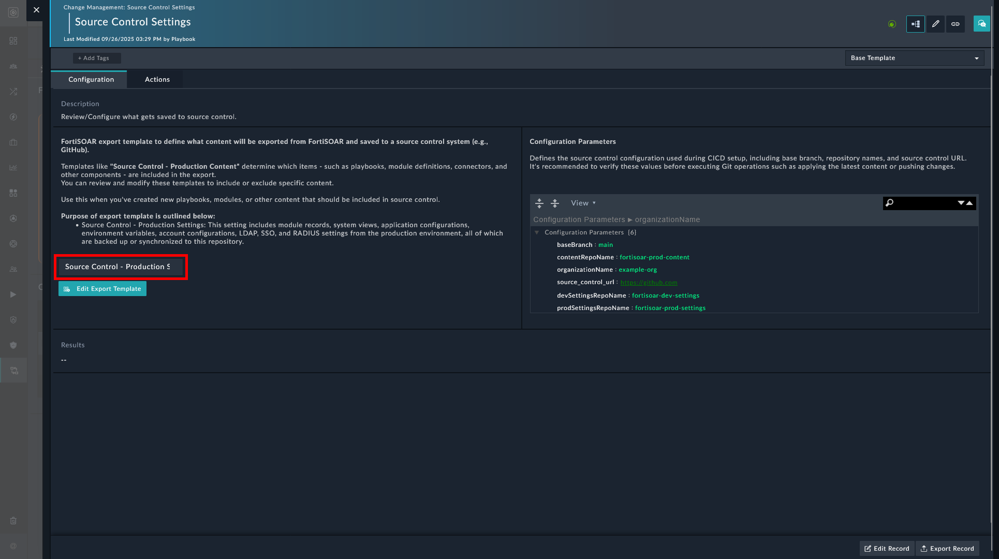
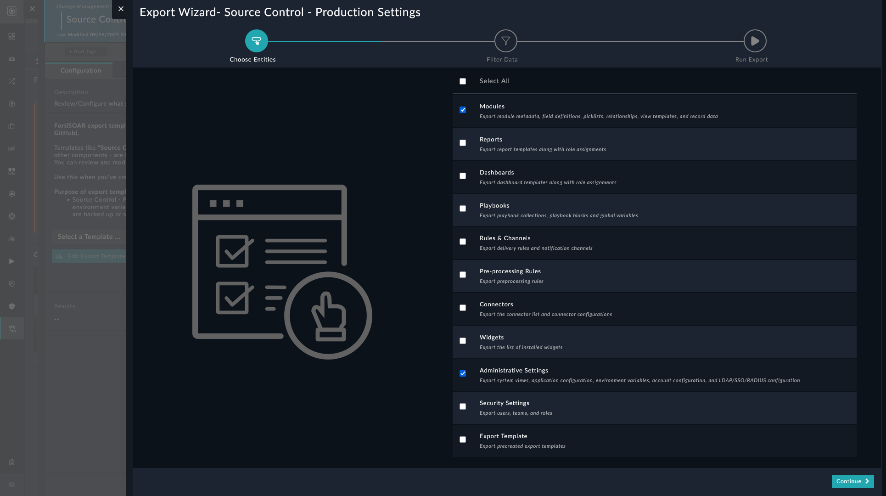
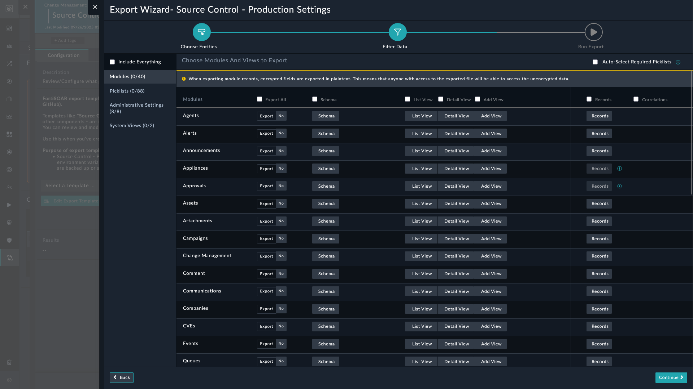
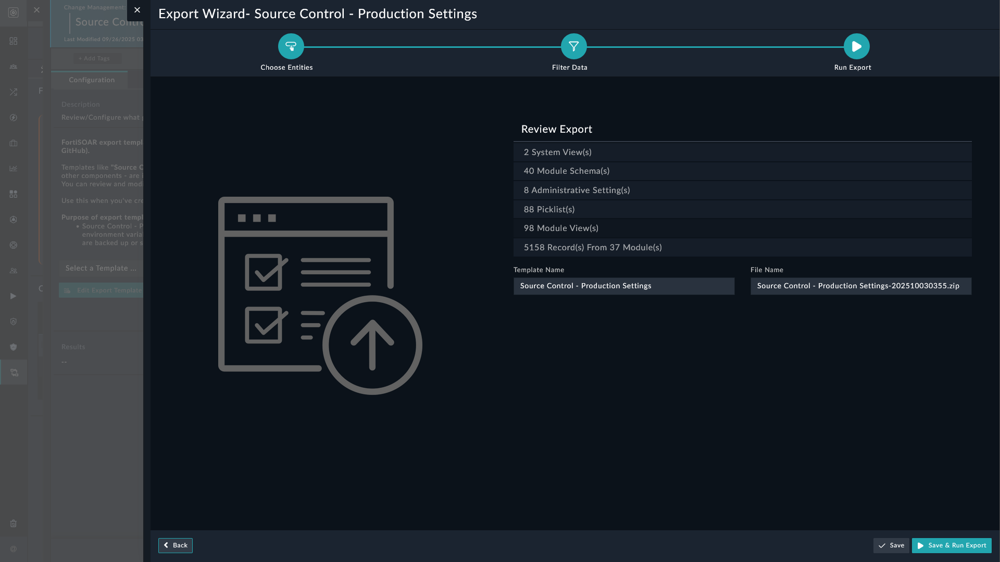

| [Home](../README.md) |
|----------------------|

# Editing Export Template

Both the *Production* and *Development* environments have the option to edit what is being written to the production and development repositories.

1. Setup Continuous Delivery on FortiSOAR environment. Refer [setting up continuous delivery on FortiSOAR](./setup.md#setup-continuous-delivery-on-fortisoar).

2. Setup *Production* and *Development* environments. Refer [setting up production environment](./setup-prod-env.md) and [setting up development environment](./setup-dev-env.md).

3. Open the *Production* or the *Development* tab under **Continuous Delivery**.

4. Click the **Source Control Settings** card.

5. Select a template to edit.

    

6. Click the button **Edit Export Template**.

    

7. Select the modules to export and click **Continue**.

    

8. Select the modules and views to export and click **Continue**.

    

9. Review the export and click **Save and Run Export**.

# Next Steps 
 
| [Installation](./setup.md#installation) | [Configuration](./setup.md#configuration) | [Usage](./usage.md) | [Contents](./contents.md) |
|----------------------------------------------|------------------------------------------------|--------------------------|--------------------------------|
