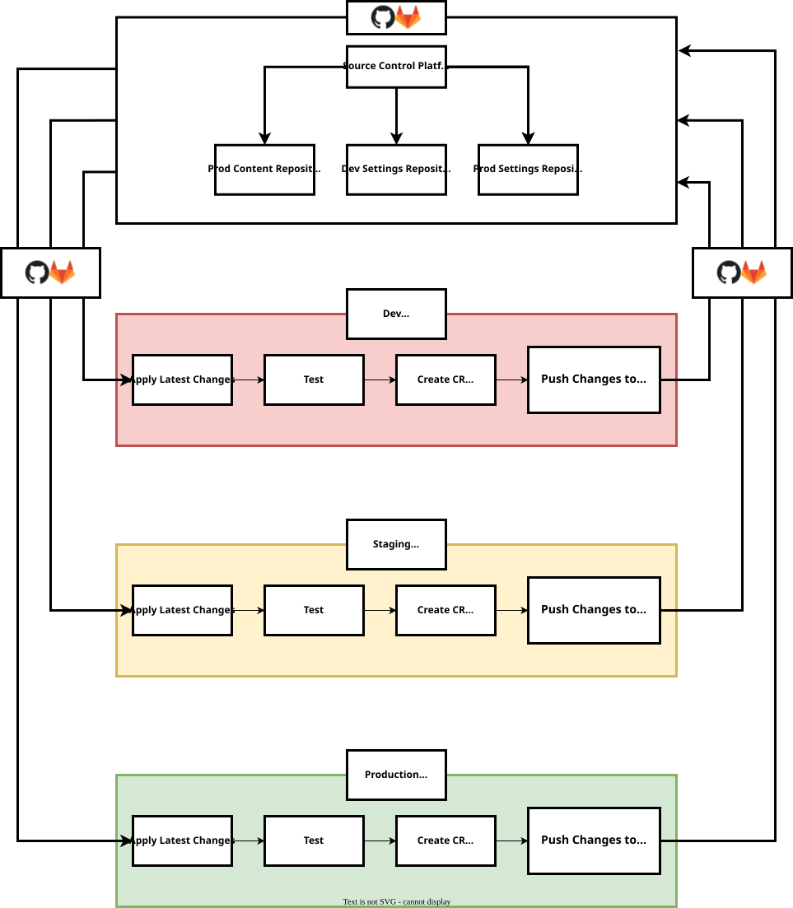

| [Home](../README.md) |
|----------------------|

## Setup Staging Environment

Setting up a staging environment sets up a sandbox for testing out the content developed by the content developers before finally rolling out the changes in production.

<!-- Following image helps understand the placement of a pre-production or a staging environment:

 -->
<!--  -->

1. [Setup Production Environment](#setup-development-environment) on a separate FortiSOAR instance and consider it *Staging Environment*.

2. [Apply latest changes](./usage.md#apply-latest-changes-in-production-environment) to make the staging instance a clone of *Production* instance.

The staging environment acts as a production environment for changes that have been successfully tested in the development environment. After ensuring that the content changes are stable in development, [apply latest changes in production environment](./usage.md#apply-latest-changes-in-production-environment).

# Next Steps 
 
| [Installation](./setup.md#installation) | [Configuration](./setup.md#configuration) | [Usage](./usage.md) | [Contents](./contents.md) |
|----------------------------------------------|------------------------------------------------|--------------------------|--------------------------------|
