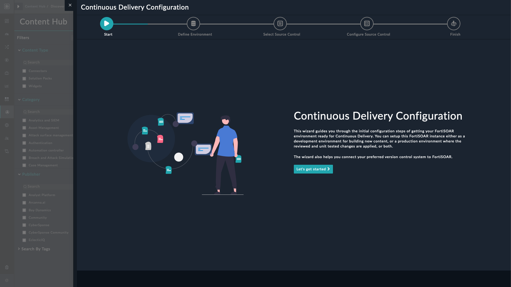
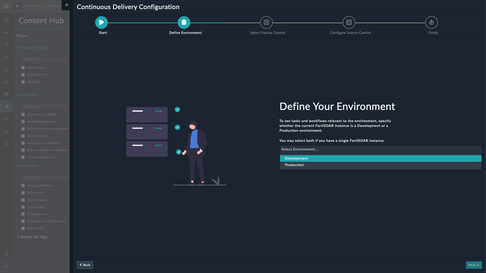
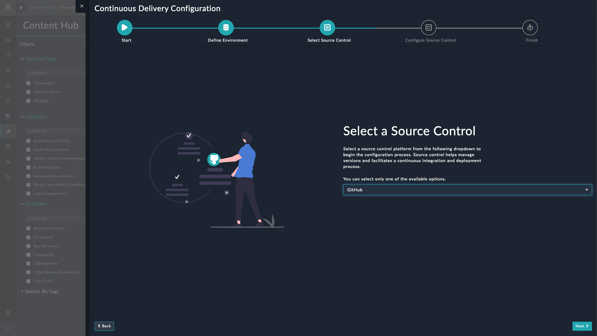
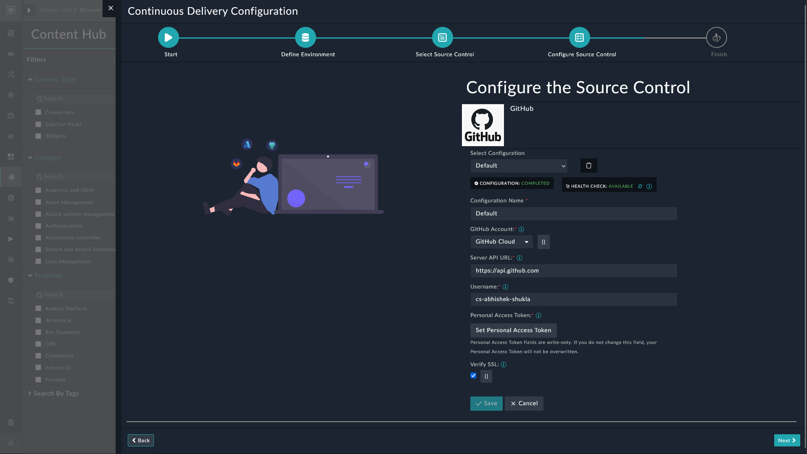
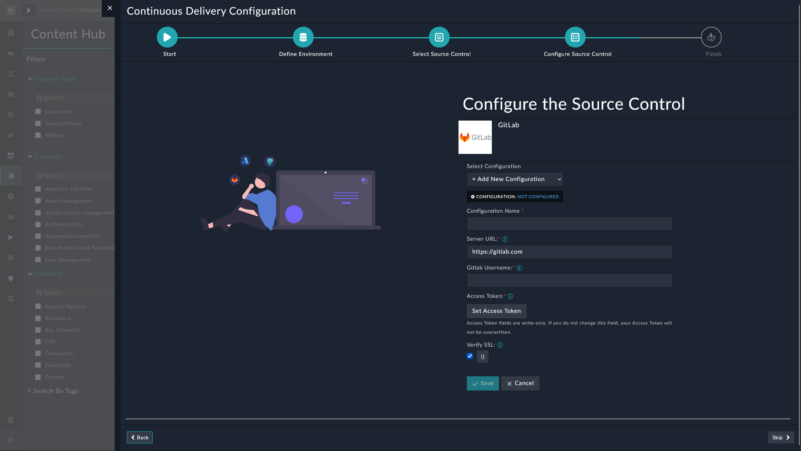
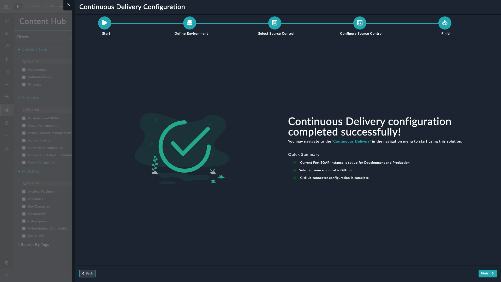

| [Home](../README.md) |
|----------------------|

# Installation

1. To install this solution pack, click **Content Hub** > **Discover**.

2. From the list of solution packs that appear, search for **Continuous Delivery** solution pack.

3. Click the **Continuous Delivery** solution pack card.

4. Click the **Install** button on the lower-left to begin the installation.

## Prerequisites

The **Continuous Delivery** solution pack depends on the following solution packs. FortiSOAR automatically installs these dependencies if missing.

| Name           | Type          | Version | Purpose                                          |
|:---------------|:--------------|:--------|:-------------------------------------------------|
| SOAR Framework | Solution Pack | v2.0.0  | Required for Incident Response modules           |

> [!NOTE]
> Development and Production environments in FortiSOAR must have the same license type.

You also need the following to use the **Continuous Delivery** solution pack:

- **An organizational account**
    An organization account is a type of account that represents an organization, instead of an individual user. It allows multiple users to collaborate on projects and manage access to repositories and teams. For more information, refer:

    - [Organization accounts - GitHub](https://docs.github.com/en/get-started/learning-about-github/types-of-github-accounts#organization-accounts)

    - [Create the organization parent group and subgroups - GitLab](https://docs.gitlab.com/ee/tutorials/manage_user/#create-the-organization-parent-group-and-subgroups)

- **User Account**

    FortiSOAR user accounts must be correctly mapped with their source control usernames. For more information, refer:

    - [What is user mapping?](./terminologies.md#user-mapping-in-connectors)

    - [Adding users to your organization - GitHub](https://docs.github.com/en/organizations/managing-membership-in-your-organization/can-i-create-accounts-for-people-in-my-organization#adding-users-to-your-organization)

    - [Add users to a project - GitLab](https://docs.gitlab.com/ee/user/project/members/#add-users-to-a-project)

- **Source control platform's user roles**

    To use the wizard for setting up source control and creating repositories through playbooks, FortiSOAR admin must have appropriate rights to create repositories on your preferred source control platform.

    - **Application Editor (GitHub & GitLab)**

        | **Task**                       | **GitHub (Fine-grained PAT + Repo Permissions)**                              | **GitLab (API Scopes + Project Permissions)** |
        | ------------------------------ | ----------------------------------------------------------------------------- | --------------------------------------------- |
        | Create repository              | `organization:write`, `repository:write` (with “Create repositories” enabled) | `api` scope + Group role = **Maintainer**     |
        | Create branch                  | `contents:write`                                                              | Project role = **Developer** or higher        |
        | Create issue (on private repo) | `issues:write` + repo access                                                  | `api` scope + **Reporter** or higher          |
        | Close issue                    | `issues:write`                                                                | `api` scope + **Reporter** or higher          |
        | Fetch issues / PRs             | `issues:read`, `pull_requests:read`                                           | `read_api` scope + **Reporter** or higher     |
        | Approve & Merge PR             | `pull_requests:write` + `contents:write`                                      | **Maintainer**                                |
        | Delete branch                  | `contents:write`                                                              | **Developer** or higher                       |

    - **Content Developer (GitHub & GitLab)**

        | **Task**           | **GitHub (Fine-grained PAT + Repo Permissions)** | **GitLab (API Scopes + Project Permissions)** |
        | ------------------ | ------------------------------------------------ | --------------------------------------------- |
        | Commit / Push      | `contents:write`                                 | **Developer**                                 |
        | Create PR          | `pull_requests:write`, `contents:write`          | **Developer**                                 |
        | Fetch issues       | `issues:read`                                    | `read_api` scope + **Reporter** or higher     |
        | Edit issue details | `issues:write`                                   | `api` scope + **Reporter** or higher          |

        For more information, refer to the following:

        - [Permissions for each role - GitHub](https://docs.github.com/en/organizations/managing-user-access-to-your-organizations-repositories/repository-roles-for-an-organization#permissions-for-each-role)

        - [Permissions and roles - GitLab](https://docs.gitlab.com/ee/user/permissions.html)

> [!NOTE]
> If the production FortiSOAR instance is separate from the development FortiSOAR instance, the content developers working in development environment must also be added in production FortiSOAR instance, and their respective source control usernames be appropriately mapped in connector configurations.

- **Source Control Repositories**

    FortiSOAR's **Continuous Delivery** solution pack creates repositories for you during the setup process. Alternatively, you may prefer to map existing repositories with this solution pack.

    For mapping repositories with content changes on the FortiSOAR instance, there must be the following three repositories:

    1. **Production Content Repository**: Production content, dev content, staging and test changes reside on the *same* repository. To avoid accidental merges and conflicts, it is recommended that this branch be protected by using pull requests to merge developmental changes.
        - [About branch protection rules - GitHub](https://docs.github.com/en/repositories/configuring-branches-and-merges-in-your-repository/managing-protected-branches/about-protected-branches#about-branch-protection-rules)

        - [Protect a branch - GitLab](https://docs.gitlab.com/user/project/repository/branches/protected/#protect-a-branch)

    2. **Production Settings Repository**: Production settings containing system views (e.g. Navigation Menu structure), application configuration, environment variables, account configuration, LDAP, SSO, and RADIUS configuration of a production environment are saved to this repository. Development environment must not have access to this repository as it uses production configurations and information.

    3. **Development Settings Repository**: Development settings containing system views, application configuration, environment variables, account configuration, LDAP, SSO, and RADIUS configuration of a development environment are backed up or synced on this repository.

> [!NOTE]
> Users who are setting up production environment in the Continuous Delivery solution pack and creating repositories, must have permissions to create private repositories.
> - [Restricting repository creation in your organization - GitHub](https://docs.github.com/en/organizations/managing-organization-settings/restricting-repository-creation-in-your-organization)
> - [Private projects and groups - GitLab](https://docs.gitlab.com/ee/user/public_access.html#private-projects-and-groups)

# Configuration

This section details the required configurations for optimal performance of the **Continuous Delivery** solution pack.

- A source control connector for tracking and managing changes to code:

    - To configure and use the GitHub connector to track and manage changes through GitHub, refer to [Configuring GitHub](https://docs.fortinet.com/fortisoar/connectors/github).

    - To configure and use the GitLab connector to track and manage changes through GitLab, refer to [Configuring GitLab](https://docs.fortinet.com/fortisoar/connectors/gitlab).

> [!NOTE]
> FortiSOAR users directly interacting with their preferred source control platform must be appropriately mapped with corresponding usernames in their source control's connector configurations.

## Setup Continuous Delivery on FortiSOAR

After installation of the **Continuous Delivery** solution pack, run the configuration wizard to ready your FortiSOAR environment. This wizard helps you connect your FortiSOAR development and production environments to your preferred source control.

1. Log in to FortiSOAR and [after installation](#installation), click the button **Configure** from the lower-left of the screen.

    

2. Click the button **Let's get started** on the Continuous Delivery configuration page.

    

3. Specify whether you want the FortiSOAR instance to be a production environment or development environment and click **Next**.

    

4. Select a preferred source control platform from the following options:

    - GitHub
    - GitLab

    

5. Add configuration information for setting up interactions with your preferred source control platform. You can set up multiple configurations for multiple users, depending on their access levels. Click **Next** on the lower-right corner to proceed. You can skip configuring the connector now and click **Skip** to proceed.

    |  |  |
    |:-----------------------------------------------------------------:|:-----------------------------------------------------------------:|
    |                    Setup source control GitHub                    |                    Setup source control GitLab                    |

> [!NOTE]
> To setup a new configuration, select <picture><source media="(prefers-color-scheme: dark)" srcset="./res/icon-add-light.svg"><source media="(prefers-color-scheme: light)" srcset="./res/icon-add-dark.svg"></picture> **Add New Configuration** from the *Select Configuration* field.

6. Click **Finish** to complete the configuration process.

    

# Additional Resources

- [Setup Production Environment](./setup-prod-env.md)

- [Setup Development Environment](./setup-dev-env.md)

- [Setup Staging Environment](./setup-staging-env.md)

- [Update Configuration Parameters](./update-config-params.md)

# Next Steps 
 
| [Contents](./contents.md) | [Usage](./usage.md) |
|---------------------------|---------------------|
