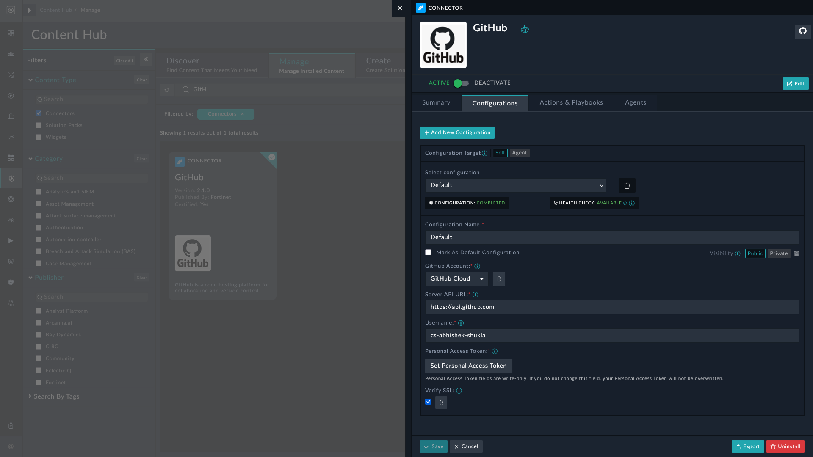

| [Home](../README.md) |
|----------------------|

# Terminology

This section provides a comprehensive list of specialized terms and definitions used in this document. It serves as a reference guide to ensure that any communication regarding FortiSOAR's **Continuous Delivery** solution pack is clear and consistent. The section may include definitions, abbreviations, acronyms, and jargon that are unique to this solution pack.

This terminology section may be regularly updated to reflect any changes or additions to the terms used throughout this document.

### Content

Content or FortiSOAR content includes customizable components like playbooks, connectors, roles, and module schemas to name a few.

### Production Settings

Production settings are system views, application configuration, environment variables, account configuration, LDAP, SSO, and RADIUS configuration in a production environment.

### Development Settings

Development settings are system views, application configuration, environment variables, account configuration, LDAP, SSO, and RADIUS configuration in a development environment.

### Staging environment

It is an intermediate instance that mirrors production for the purposes of testing, but exists on the same level as production from the perspective of a development environment.

- In other words:

  - For the **Development Environment**, staging acts as "Production" &ndash; the place where dev changes are validated before reaching the main production.

  - For the **Production Environment**, staging acts as "Development" &ndash; a sandbox for testing content that will eventually be applied to production.

### FortiSOAR Admin

A FortiSOAR admin has administrative rights on any FortiSOAR instance. For more information on users and roles, refer to [Tasks & Permissions](https://docs.fortinet.com/document/fortisoar/7.3.1/administration-guide/249178/overview#Tasks_and_Permissions) in  FortiSOAR Administration Guide.

### Source Control

Source control (or version control) is the practice of tracking and managing changes to code. Source control management (SCM) systems provide a running history of code development and help resolve conflicts when merging contributions from multiple sources. Common examples of source control are **GitHub** and **GitLab**.

### Source Control Production Admin

A source control administrator has rights to create users, assign permissions, create, and manage repositories in an organization. Refer to following articles that details various user roles and access:

- [Roles in an organization - **_GitHub_**](https://docs.github.com/en/organizations/managing-peoples-access-to-your-organization-with-roles/roles-in-an-organization)

- [Roles in an organization - **_GitLab_**](https://docs.gitlab.com/ee/user/project/members/index.html)

### User Mapping in Connectors

User mapping in this document refers to using FortiSOAR user's source control username in connector configuration.

----

Consider a FortiSOAR user `jdoe`, whose GitHub username is *`j-doe-github`*, wants to map `jdoe` with their *GitHub* username *`j-doe-github`*. `jdoe` must perform the following steps for correct user mapping:

1. Log in to FortiSOAR using credentials associated with `jdoe`.

2. Navigate to **Automation** <picture><source media="(prefers-color-scheme: dark)" srcset="./res/icon-chevron-light.svg"><source media="(prefers-color-scheme: light)" srcset="./res/icon-chevron-dark.svg"></picture> **Connectors**.

3. Specify *`j-doe-github`* in the **Username** field on the GitHub connector's configuration page.

4. Specify the associated PAT. To know how to generate PATs refer:
    - [GitHub - Creating a personal access token (classic)](https://docs.github.com/en/authentication/keeping-your-account-and-data-secure/managing-your-personal-access-tokens#creating-a-personal-access-token-classic)

    - [GitLab - Create a personal access token](https://docs.gitlab.com/user/profile/personal_access_tokens/#create-a-personal-access-token)

----

# Next Steps 
 
| [Installation](./setup.md#installation) | [Configuration](./setup.md#configuration) | [Usage](./usage.md) | [Contents](./contents.md) |
|----------------------------------------------|------------------------------------------------|--------------------------|--------------------------------|
