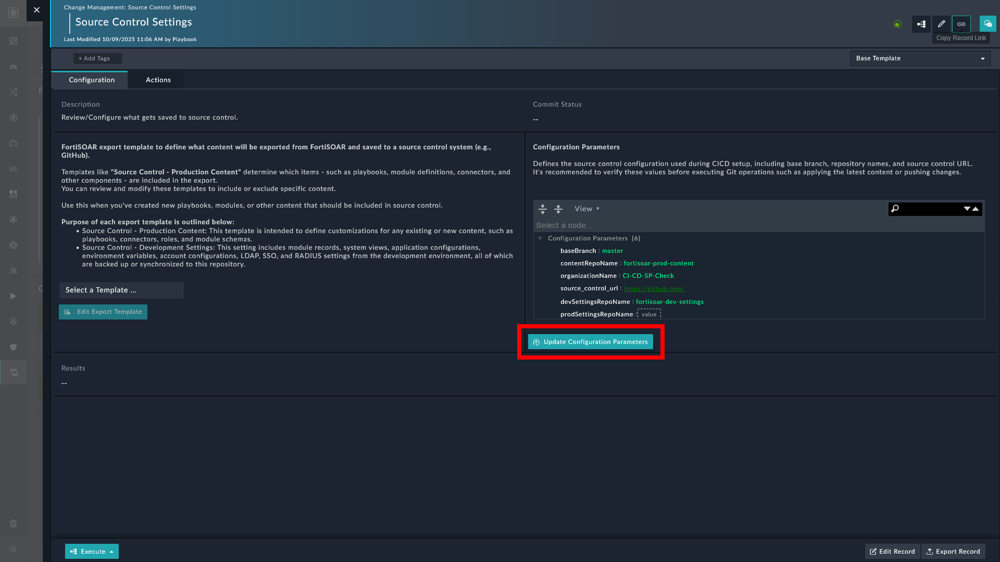
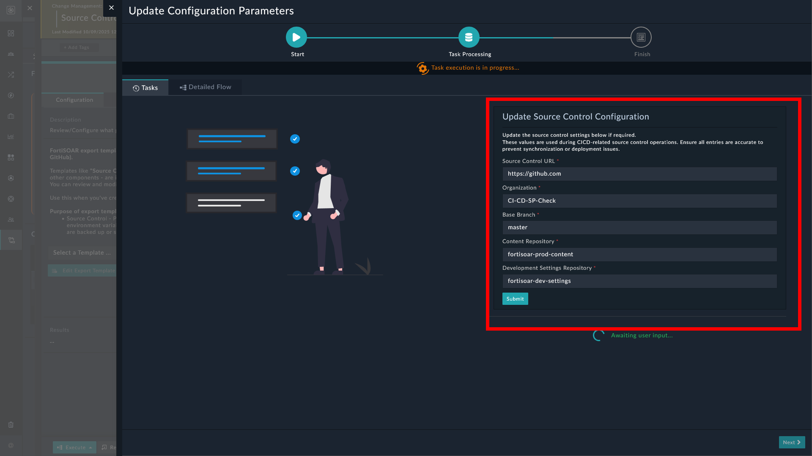

| [Home](../README.md) |
|----------------------|

## Updating Configuration Parameters

You can update configuration parameters to use repositories and branch name of your choice. It is especially helpful for setting up a pre-production or a staging environment. To update the configuration parameters *after* the production or development environments have been set up:

1. Launch **Continuous Delivery**.

2. Navigate to the respective environment's tab and click <picture><source media="(prefers-color-scheme: dark)" srcset="./res/icon-update-light.svg"><source media="(prefers-color-scheme: light)" srcset="./res/icon-update-dark.svg"></picture> **Update Configuration Parameters**. For example, to update configuration parameters of the production environment, click the **Production** tab on the FortiSOAR production instance.

    

    A wizard launches and brings up the following screen:

    

    1. Enter the Organization's name as created on your preferred source control platform.

    2. Enter the repository names to be created under the specified organization. To accept the auto-populated suggested name, leave the fields as-is.

    3. Enter the **Base Branch Name** to be created under the specified repositories. To accept the auto-populated suggested name, leave the field as-is.

    4. Click **Setup** to proceed.

    5. Click the button **Create Repositories** to let the playbooks automatically create the repo (repository) and the specified branch in each repo.

        1. Click the button **I have the repositories** if you have already created the repositories, with the exact same names as specified in the earlier step, on your preferred source control platform.

        2. Click the button **Confirm**, after creating the repositories, for FortiSOAR to check if the specified repositories exist.

    6. Click the button **Push** to push the content from FortiSOAR to the specified branch of the repository mentioned in Development Content.

        Pushing overwrites the contents of the repository mentioned in Development Content. You can click the button **Skip** to push the contents later.

# Next Steps 
 
| [Installation](./setup.md#installation) | [Configuration](./setup.md#configuration) | [Usage](./usage.md) | [Contents](./contents.md) |
|----------------------------------------------|------------------------------------------------|--------------------------|--------------------------------|
