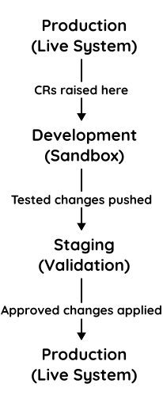
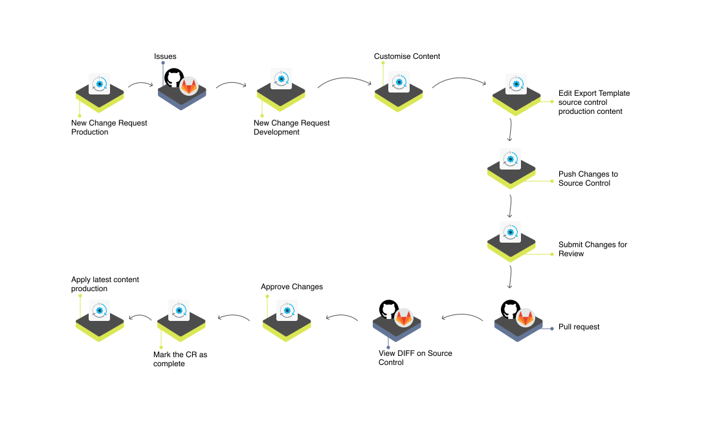

| [Home](../README.md) |
|----------------------|

# Usage

This section explains how to use the **Continuous Delivery (CI/CD) solution pack** in FortiSOAR for managing content changes, synchronizing environments, and integrating with external source control platforms like GitHub or GitLab. It walks through the complete lifecycle of a Change Request (CR), from creation to approval, and shows how administrators and developers can collaborate effectively to manage FortiSOAR content in a controlled, versioned manner.

The instructions in this guide are scenario-driven, focusing on practical workflows such as creating new playbooks or modules, exporting settings, or applying changes from source control to production environments. Each section highlights the actions required by specific roles to maintain separation of duties and ensure smooth content delivery.

## Understanding the Environments

The CI/CD solution pack for FortiSOAR assumes a **three-tier environment setup**: **Development**, **Staging**, and **Production**. Each environment serves a unique purpose and interacts with source control to enable controlled, auditable changes.

### Production Environment

The production environment is your "live" FortiSOAR system handling real security incidents. Changes here must be deliberate and thoroughly tested to avoid disrupting operations.

Admins raise **Change Requests (CRs)** in production when new customizations or updates are required. These CRs are synchronized with source control and assigned to developers for implementation.

*Example:* An admin raises a CR to add a new phishing triage playbook. The CR is sent to the development team via source control.

### Development Environment

The development environment is a sandbox where developers implement and test new content or configuration changes. Changes are iterative and experimental here.

Once development is complete, changes are submitted as **Pull Requests (PRs)** in source control. Admins review and approve these PRs before applying changes to production.

*Example:* A developer creates a new phishing triage playbook, tests it in development, and submits a PR for review.

### Staging Environment

The staging environment serves as an **intermediate validation layer** between development and production. Its role depends on perspective:

- **For Development:** Staging is "Production" &ndash; developers deploy their tested changes here to ensure they work in an environment similar to the actual production instance.
- **For Production:** Staging is "Development" &ndash; admins can see changes applied here before they reach live production, ensuring a safe rollout.

*Example:* After testing a new playbook in development, a developer deploys it to staging. Admins and other testers validate the playbook in staging before approving its application in production.

### Flow Between Environments

1. **Production → Development:** Admins raise CRs in production that are implemented in development.
2. **Development → Staging:** Developers push changes from development to staging for intermediate validation.
3. **Staging → Production:** Admins approve and apply validated changes from staging into the production environment.

This three-tier setup ensures that production remains stable while supporting continuous development and controlled deployment of changes.

Here's a textual diagram and table to make the three-tier flow clearer:

### Environment Roles Table

| Environment     | Primary Role                                | Perspective | Example Actions                                                                                    |
|-----------------|---------------------------------------------|-------------|----------------------------------------------------------------------------------------------------|
| **Production**  | Live incident handling                      | Admin       | Raise CRs, approve/merge changes, apply latest content                                             |
| **Development** | Sandbox for implementing changes            | Developer   | Build new playbooks, dashboards, modules; push changes to source control                           |
| **Staging**     | Validation layer between dev and production | Hybrid      | Test developer changes in a near-production setting before final rollout; QA by admins and testers |

## Lifecycle of a Change Request (CR)

This section explains how a change request (CR) moves through the Continuous Delivery workflow, from creation in FortiSOAR to deployment in the production environment. The workflow ensures that content developed in a **Development Environment** is reviewed, tested, and safely applied to the **Production Environment**. Staging environments act as an intermediate sandbox, providing a "production-like" testing space before final deployment.

### Steps in the CR Lifecycle

1. **Create a Change Request (Production Environment)**
   The application administrator creates a new CR in FortiSOAR's **Production Environment**.

   - Refer to [Creating a new CR]./usage.md#creating-a-new-change-request).
   - The CR automatically appears as a new issue under **Issues** in the source control repository for the production content.

2. **Build the Content (Development Environment)**
   The content developer works on the CR in the **Development Environment**, implementing the requested changes.

   - If required, the developer edits the export template to include new playbooks, dashboards, rules, or other content.

> [!WARNING]
> Do not delete or rename existing export templates. Cloning an export template with the same name as an existing one can cause merge conflicts and data loss.

3. **Push Changes to Source Control (Development Environment)**
   The developer selects the CR in FortiSOAR and clicks **Push Changes to Source Control**.

   - A new branch is created on the source control platform containing the changes from this CR.
   - The changes are committed and pushed to the branch automatically.

4. **Submit Changes for Review (Development Environment)**
   The developer selects the CR again and clicks **Submit Changes for Review**.

   - This action creates a pull request (PR) on the source control platform with the title and reviewers specified by the developer.

5. **Review the Pull Request (Source Control Platform)**
   CRs with changes appear under the **Pull Request** column in FortiSOAR.

> [!NOTE]
> Reviewers must log in to the source control platform to view the `diff`. Without logging in, FortiSOAR cannot display the PR differences.

6. **Approve Changes (Production Environment)**
   The application administrator reviews and approves the PR in FortiSOAR.

   - Approving the CR merges the PR into the main branch.
   - The CR branch is automatically deleted.

7. **Mark CR as Complete (Production Environment)**
   The administrator selects the CR again and clicks **Mark as Complete**.

   - This closes the CR in FortiSOAR and the source control platform.

8. **Apply Latest Content to Production Environment**
   Once the CR is approved and completed, the application administrator clicks **Apply Latest Content** in FortiSOAR.

   - This initiates a `git merge` of the changes on the source control platform with the production instance.
   - If a **Staging Environment** is configured, the merge can first be applied there for validation before final production deployment.

> [!TIP]
> Always validate content in a staging environment (if available) before applying to production to catch potential issues early.

## Creating a New Change Request

You can raise a change request (CR) from within the FortiSOAR's production environment and assign it to a content developer for further action. To create a new CR and assign it to a content developer:

1. Select **Continuous Delivery** from the FortiSOAR menu.

2. Select the tab **Production**.

3. Click <picture><source media="(prefers-color-scheme: dark)" srcset="./res/icon-add-light.svg"><source media="(prefers-color-scheme: light)" srcset="./res/icon-add-dark.svg"></picture> **Create New Request**.

4. Enter a **Summary** and an appropriate **Description** for the CR.

5. Select a user from the **Assignee** drop-down to assign the CR.

6. Click **Submit** to save and submit the CR for further action.

The raised CR appears under **Issues** on the source control platform under your organization's Production Content repository and under the **Continuous Delivery** menu for Application Administrators.

## Working on a new Change Request

> [!TIP]
> Once the *Development* environment is set up, click the card **Apply Latest Content* to make the development instance a clone of *Production* instance (Required if the production and development FortiSOAR instances are separate).

The raised CR also appears under the **Continuous Delivery** menu for the Content Developer to whom the issue is assigned. Use the refresh icon <picture><source media="(prefers-color-scheme: dark)" srcset="./res/icon-refresh-light.svg"><source media="(prefers-color-scheme: light)" srcset="./res/icon-refresh-dark.svg"></picture>, if the CR does not appear automatically.

After content developers are done making the customizations to address the CR raised in FortiSOAR:

1. [Edit the export template](./editing-export-template.md) to include the content created. 
    
   For example, if the content developers have built a new Dashboard, they need to edit the export template, select **Module** and click **Continue**, select the newly created Dashboard on the next screen, and click **Save**. This action ensures that the new dashboard is part of the content to be pushed to source control. For

2. Select the CR and click **Push Changes**. Following tasks are performed:

   1. A branch containing the changes of this CR is created on the source control platform.

   2. The changes are committed and pushed to the new branch.

   3. A prompt asks the content developer to specify a **Summary** (mandatory) and **Description** (optional) of the commit message.

2. Select the CR again and click **Submit for Review**. Creation of a PR is initiated.

3. Specify a **Title** of the PR.

4. Select **Reviewers Name** from the list. Content developer is not listed as the reviewer.

## Approving & Completing a CR in Production Environment

The CR submitted for review needs approval of the application administrator in FortiSOAR. The application administrator now has to approve, merge, and mark the changes as complete in production environment.

1. Select **Continuous Delivery** from the FortiSOAR menu.

2. Select the tab **Production**.

3. CRs with changes appear with a PR name under the column **Pull Request**.

> [!NOTE]
> The reviewers have to log in to the source control platform to view the comparable differences (`diff`).

4. Select the CR in FortiSOAR and click **Approve Changes**. This merges the PR into the main branch and deletes the CR branch.

5. Select the CR again and click **Mark as Complete** to close the issue from FortiSOAR and the source control platform.

## Applying Latest changes in Production environment

Application administrators may want to merge the customizations on the source control platform on the main branch to production instance on FortiSOAR.

1. Select **Continuous Delivery** from the FortiSOAR menu.

2. Select the tab **Production**.

3. Click the tile **Apply Latest Content**.

4. From the drop-down choose whether to apply the *Production Content* or *Production Settings*.

5. Click the button **Submit**.

6. Click **Yes** on the confirmation to initiate a git merge of content on the source control platform with content on the FortiSOAR instance.

Once the changes are applied, logout and login again to view published changes.

## Saving Development Settings

1. Select **Continuous Delivery** from the FortiSOAR menu.

2. Select the tab **Development**.

3. Click the tile **Save Development Settings** to initiate export of development settings like connector configurations, SSO settings, and user configurations to the source control platform in the repository mapped with FortiSOAR Development Settings.

## Applying Latest changes in Development environment

Application administrators may want to merge the customizations on the source control platform on the main branch to development instance on FortiSOAR.

1. Select **Continuous Delivery** from the FortiSOAR menu.

2. Select the tab **Development**.

3. Click the tile **Apply Latest Content**.

4. From the drop-down choose whether to apply the *Production Content* or *Development Settings*.

5. Click the button **Submit**.

6. Click **Yes** on the confirmation to initiate a git merge of content on the source control platform with content on the FortiSOAR instance.

Once the changes are applied, logout and login again to view published changes.

## View Closed CRs since Last Deployment

Following section explains how to get a list of closed change requests (CRs) since the last time **Apply Latest Changes** was performed on the production environment.

1. Select **Continuous Delivery** from the FortiSOAR menu.

2. Click **Apply Latest Content** tile under the **Production** tab.

3. Click **Fetch Latest Changes** button from the lower-left of the screen to get the list of issues resolved since the last applied change.

# Additional Resources

- [Terminologies](./docs/terminologies.md) &ndash; Short description about commonly used terms across the document

- [Setting up Source control &ndash; initial configuration](./docs/initial-source-control-setup.md) &ndash; checklist of basic configurations that must be in place for the most efficient usage of **Continuous Delivery** solution pack

- [Best Practices](./docs/best-practices.md) &ndash; pointers to avoid common pitfalls when working with source control

- [CR for Building a new Playbook](./docs/build-playbook-cr.md)

- [CR for Building a new Module](./docs/build-module-cr.md)

- [Including Connector Installation and Configuration in Source Control](./docs/connector-inst-config-git.md)

- [Exporting Sample Alerts/Incidents from Prod Environment](./docs/export-alerts-incidents-from-prod.md)

- [Editing the Export Template](./editing-export-template.md)

- [Upgrade Instructions](./docs/upgrade-instructions.md) &ndash; absolutely important to go through before, and after, upgrading of **Continuous Delivery** solution pack
 
# Next Steps 

| [Installation](./setup.md#installation) | [Configuration](./setup.md#configuration) | [Contents](./contents.md) |
|-----------------------------------------|-------------------------------------------|---------------------------|
